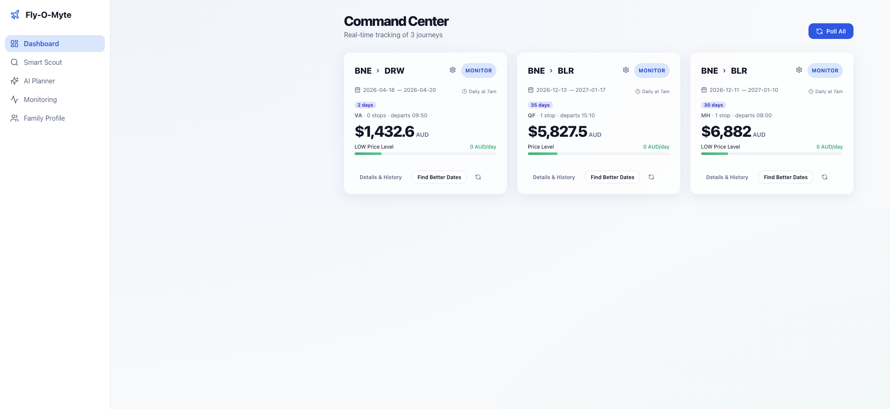

# Fly-O-Myte ✈️

The smart travel expense optimizer for Australian families. Tracks the specific trips you are considering, builds its own price history, and tells you one thing: **Book Now, Wait, or Monitor** — with a real explanation of why.

Fly-O-Myte calculates the **True Family Cost** including bags, seat selection, and infant fees, ensuring you never get surprised by "budget" airline add-ons.



---

## 🛠️ Prerequisites

Before installing, ensure you have the following installed:
- **Python 3.11+**
- **Node.js 18+** (v20+ recommended)
- **uv** (Python package manager: `curl -LsSf https://astral.sh/uv/install.sh | sh`)

## 🚀 Quick Start (Web UI)

The recommended way to use Fly-O-Myte is via the modern Web UI.

1. **Install Dependencies**
   ```bash
   make install
   ```
   *This will sync both Python and Node.js dependencies.*

2. **Configure Your Family**
   Set up your passengers, origin airport, and school holiday state in the **Family Profile** tab.

3. **Set API Keys**
   Create a `.env` file with your credentials:
   ```bash
   echo "SERPAPI_API_KEY=your_key_here" >> .env
   echo "ANTHROPIC_API_KEY=your_key_here" >> .env # Optional for AI Planner
   ```

4. **Launch the App**
   ```bash
   make app
   ```
   Visit **[http://localhost:5173](http://localhost:5173)** to start scouting and tracking journeys.

---

## ✨ Key Features

### 📊 Dashboard (Command Center)
Real-time tracking of your watchlisted trips. High-signal **Book Now / Wait / Monitor** badges with vibrant gradients indicate urgency based on historical trends and current price signals.

### 🔍 Smart Scout
Interactive month-at-a-glance heatmaps. Features a **Holiday Shield** overlay that highlights school holiday periods (QLD/NSW/VIC/etc.) so you can identify the cheapest travel windows before prices spike.

### 🤖 AI Planner
Natural language trip planning: *"Bangalore in December for 25 days"* or *"Japan for cherry blossoms"*. The engine extracts intent and generates scouting windows instantly.

### 🔌 Extensible Price Sources
Pluggable architecture (via `pluggy`) supporting multiple providers:
- **SerpAPI (Google Flights)**: Primary source for comprehensive global coverage.
- **Amadeus**: Advanced flight price analysis and market signals.
- **Tequila (Kiwi.com)**: Broad search capabilities across hundreds of airlines.

---

## 💻 CLI Reference

For power users, the `fom` CLI remains fully supported:

```bash
fom setup                                   First-run wizard
fom scout BNE SYD --months jul-2026         Interactive month scouting
fom watch BNE SYD 2026-07-20 2026-07-27    Start tracking a journey
fom status                                  Morning check of all trips
fom flex <id>                               Find ±3 day alternatives
fom plan "Sri Lanka in July"                Natural language planning
fom poll                                    Update all tracked prices
```

---

## 🧮 True Family Cost Calculation

Fly-O-Myte never shows just the base fare. Every price shown is the **True Family Cost**:

```
  Base fare per adult  ×  adults
+ Child fares (estimated based on age)
+ Checked bags  ×  total passengers
+ Seat selection  ×  total passengers
+ Infant lap fees ×  sectors
──────────────────────────────────────
= TRUE FAMILY COST (AUD)
```

Pricing logic accounts for airline-specific rules across 15+ major carriers (Qantas, Virgin, Jetstar, Singapore Airlines, Emirates, etc.).

---

## 🛠️ Architecture & Data

- **Backend**: FastAPI (Python 3.11+) with SQLModel (SQLite) for persistence.
- **Frontend**: React (TypeScript) with Vite and interactive data visualizations.
- **Analytics**: DuckDB for high-performance route context and statistical analysis.
- **CI/CD**: Rigorous quality gates with `ruff`, `pyright`, and `pytest`.

All data lives locally in `~/.fly-o-myte/` to ensure your travel plans remain private.

---

## 📜 License

MIT License. See [LICENSE](LICENSE) for details.
